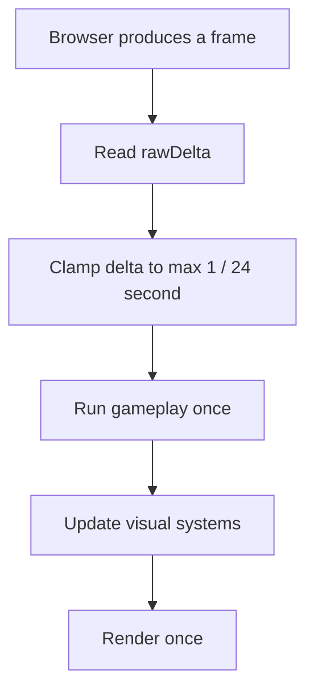
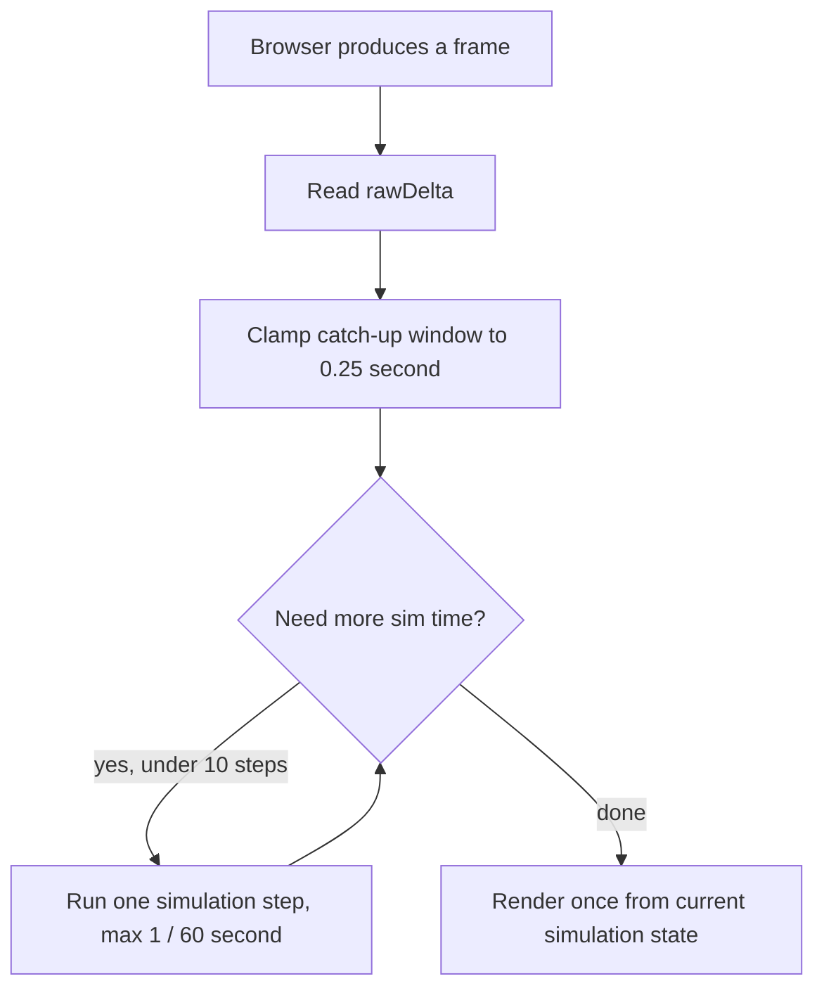
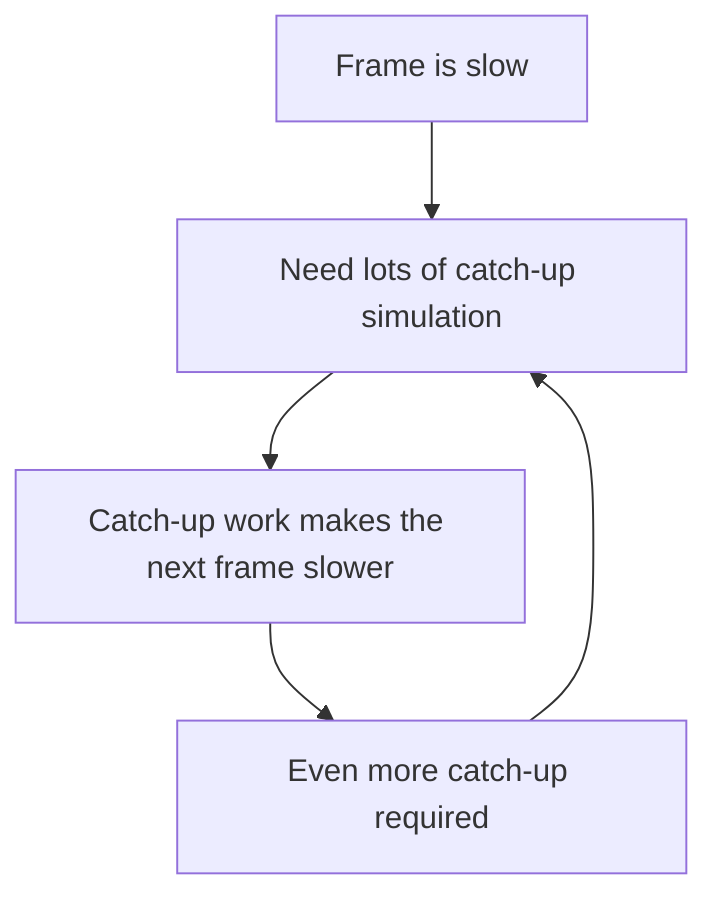

# Frame-Rate Independent Simulation Notes

This note explains the `v0.5.3-ALPHA` timing change that made gameplay pace less
dependent on render frame rate.

Audience assumption: you are comfortable with application loops, clocks, and
state machines, but not necessarily with game-loop terminology.

## Names Used In Snippets

- `performance.now()` is the browser's built-in high-resolution timer. It is
  not an app dependency or Three.js API. TypeScript knows about it through DOM
  browser typings, so an IDE may show it as coming from the configured web
  platform types.
- `clock` is this app's `THREE.Clock` instance. `clock.getDelta()` returns real
  seconds since the previous animation frame. `clock.elapsedTime` returns total
  real seconds since that clock started.
- `rawDelta` means "actual elapsed seconds since the browser last gave us a
  frame."
- `delta` means "the amount of time this specific update should simulate."
  Before the change, that was a capped version of `rawDelta`. After the change,
  simulation steps receive smaller slices of `rawDelta`.
- `simulationTimeSeconds` is this app's gameplay clock. It advances only when
  the simulation advances, so pause menus and main-menu time do not age
  gameplay state.
- `frameStartedAt` and `renderStartedAt` are diagnostic timestamps. They are
  used to measure update/render cost for the performance overlay; they do not
  drive gameplay.
- `player`, `trainingRun`, `particles`, `wakeField`, and `rippleField` are app
  systems. The important distinction is that some systems change gameplay state
  while others present the current state visually.

## Short Version

Before the change, the browser render frame was also the gameplay tick. If the
browser rendered fewer frames, the game got fewer opportunities to advance
player movement and gameplay state. The loop also capped frame delta, so very
slow frames advanced less simulated time than real elapsed time.

After the change, each browser frame can run multiple bounded simulation steps
before drawing once. Slow hardware still renders fewer visual frames, but
movement, jumping, Echo timing, particles, and ripple aging advance much closer
to real elapsed time.

## Before: One Render Frame, One Gameplay Tick

The old `animate()` function did everything in one pass:

```ts
function animate(): void {
  // Actual wall-clock seconds since the previous browser animation frame.
  const rawDelta = clock.getDelta();

  // Old behavior: never let gameplay simulate more than 1/24 second in one
  // rendered frame, even if the real frame took longer.
  const delta = Math.min(rawDelta, 1 / 24);

  // Three.js wall-clock time, not the app's own gameplay clock.
  const time = clock.elapsedTime;

  // Gameplay and presentation were interleaved in one render-frame callback.
  player.update(delta);
  avatar.update(delta, player.position, playerSpeed, player.getFacingYaw());
  trainingRun.update({ time, playerPosition: player.position, telemetry, raceTrack });
  collectEchoZones(time);
  maybeSpawnEchoZone(time);
  particles.update(delta);
  wakeField.render({ time, delta, ... });
  rippleField.update(time, ...);
  renderSceneFrame();
}
```

That design is simple, but it ties gameplay update frequency to render
frequency.



The `Math.min(rawDelta, 1 / 24)` cap was the direct source of slow-motion under
heavy load. At 10 FPS, one real frame is about 100 ms, but the old game loop
only simulated about 41.7 ms.

| Real frame duration | Old simulated time | Effect |
| --- | ---: | --- |
| 16.7 ms, 60 FPS | 16.7 ms | Normal pace |
| 33.3 ms, 30 FPS | 33.3 ms | Mostly correct pace, larger update chunks |
| 50.0 ms, 20 FPS | 41.7 ms | About 83% gameplay speed |
| 100.0 ms, 10 FPS | 41.7 ms | About 42% gameplay speed |

The old loop also mixed clocks:

```ts
const delta = Math.min(rawDelta, 1 / 24);
const time = clock.elapsedTime;

// Uses capped simulated time.
player.update(delta);

// Uses uncapped wall-clock time.
rippleField.update(time, ...);
```

Player movement used capped frame delta, while many visual and Echo systems used
Three.js wall-clock elapsed time. That meant low FPS could make gameplay and
visual timing disagree.

## After: Bounded Simulation Catch-Up, Then Render

The new loop separates simulation from presentation:

```ts
const SIM_STEP_SECONDS = 1 / 60;
const MAX_SIM_FRAME_SECONDS = 0.25;
const MAX_SIM_STEPS_PER_FRAME = 10;
```

```ts
function animate(): void {
  const rawDelta = clock.getDelta();

  // Browser timer used only to measure how long update/render work takes.
  const frameStartedAt = performance.now();

  // Advances gameplay in zero or more bounded simulation steps.
  const simulatedDeltaThisFrame = runSimulationFrame(rawDelta);

  // Draws the current state once.
  renderPresentation(rawDelta, simulatedDeltaThisFrame, frameStartedAt);
}
```

`runSimulationFrame()` subdivides the elapsed browser-frame time into smaller
simulation steps:

```ts
function runSimulationFrame(rawDelta: number): number {
  lastSimStepCount = 0;
  if (appState !== "playing") {
    lastSimulatedDeltaSeconds = 0;
    return 0;
  }

  let remainingDelta = Math.min(Math.max(0, rawDelta), MAX_SIM_FRAME_SECONDS);
  let simulatedDelta = 0;

  while (remainingDelta > MIN_SIM_REMAINING_SECONDS && lastSimStepCount < MAX_SIM_STEPS_PER_FRAME) {
    const stepDelta = Math.min(SIM_STEP_SECONDS, remainingDelta);
    simulationTimeSeconds += stepDelta;
    updateSimulationStep(stepDelta, simulationTimeSeconds);
    simulatedDelta += stepDelta;
    remainingDelta -= stepDelta;
    lastSimStepCount += 1;
  }

  lastSimulatedDeltaSeconds = simulatedDelta;
  return simulatedDelta;
}
```



The simulation step now contains the state changes that should happen at a
stable game pace:

```ts
function updateSimulationStep(delta: number, time: number): void {
  // Gameplay state changes live here.
  player.update(delta, time);

  if (activePlayMode === "training") {
    trainingRun.update({ time, playerPosition: player.position, telemetry, raceTrack });
    updateTrainingHud();
  }

  collectEchoZones(time);
  maybeSpawnEchoZone(time);
}
```

The presentation step still runs once per browser frame:

```ts
function renderPresentation(rawDelta: number, simulatedDeltaThisFrame: number, frameStartedAt: number): void {
  // Presentation uses the canonical gameplay time, not wall-clock elapsed time.
  const time = simulationTimeSeconds;

  avatar.update(simulatedDeltaThisFrame, time, player.position, playerSpeed, player.getFacingYaw());
  particles.spawnAura(player.position, simulatedDeltaThisFrame, playerSpeed / 18);
  particles.spawnWake(player.position, simulatedDeltaThisFrame, wakeStrength, player.velocity);
  particles.update(simulatedDeltaThisFrame);

  raceTrack.update(time);
  echoZones.update(time);
  pulseLights.update(rippleSources.getActiveLightSources(time), time, ...);
  wakeField.render({ time, delta: simulatedDeltaThisFrame, ... });
  rippleField.update(time, ...);
  renderSceneFrame();
}
```

This means the game can do several state updates, then render the latest state
once. It does not try to draw every intermediate state.

| Real frame duration | New simulation behavior | Result |
| --- | --- | --- |
| 16.7 ms, 60 FPS | 1 step of about 16.7 ms | Normal pace |
| 33.3 ms, 30 FPS | 2 steps of about 16.7 ms | Normal pace, fewer rendered frames |
| 50.0 ms, 20 FPS | 3 steps of about 16.7 ms | Normal pace, fewer rendered frames |
| 100.0 ms, 10 FPS | 6 steps of about 16.7 ms | Normal pace if under catch-up budget |
| 500.0 ms stall | capped to 10 steps / about 166.7 ms | Drops excess time to avoid a death spiral |

## Canonical Simulation Time

The app now uses `simulationTimeSeconds` as the game clock instead of mixing
`clock.elapsedTime`, `performance.now()`, and capped frame delta.

Before:

```ts
const time = clock.elapsedTime;
player.update(delta);
spawnPulse(position, strength, options, clock.elapsedTime);
```

After:

```ts
simulationTimeSeconds += stepDelta;
player.update(delta, simulationTimeSeconds);
spawnPulse(position, strength, options, simulationTimeSeconds);
```

`PlayerRig` now receives simulation time directly:

```ts
update(delta: number, timeSeconds: number): void {
  this.timeSeconds = timeSeconds;
  ...
}
```

That time is used for gameplay-sensitive timestamps:

```ts
const now = this.timeSeconds;
if (now - this.lastPulseSecond < PULSE_COOLDOWN_SECONDS) return;

this.jumpStartedAt = this.timeSeconds;
const airtimeSeconds = Math.max(0, this.timeSeconds - this.jumpStartedAt);
```

That keeps pulse cooldowns, jump airtime, wall-contact telemetry, Echo timers,
and ripple source ages in one time domain.

## Continuous-Time Smoothing

Camera smoothing was also expressed as a rate instead of as a baked
"per 60 FPS frame" value.

Before:

```ts
const CAMERA_SMOOTHING = 1 - Math.exp(-14 / 60);
const smoothing = 1 - Math.pow(1 - CAMERA_SMOOTHING, Math.max(1, delta * 60));
```

After:

```ts
const CAMERA_SMOOTHING_RATE = 14;
const smoothing = 1 - Math.exp(-CAMERA_SMOOTHING_RATE * Math.max(0, delta));
```

This is the same general idea as using exponential decay for backend retry
backoff or cache decay: the value is based on elapsed time, not on how many
times the loop happened to run.

## Particle Wake Emission

Movement wake particles were previously emitted using a per-render-frame random
chance:

```ts
spawnWake(center, movementStrength, movementVelocity): void {
  if (movementStrength <= 0.08 || Math.random() > movementStrength * 0.55 * emissionScale) return;

  const count = Math.max(6, Math.floor(rawCount * emissionScale));
  emitWakeParticle(...count...);
}
```

That means 60 rendered frames gave the wake 60 chances per second to emit, while
20 rendered frames gave it only 20 chances.

After the change, wake emission accumulates particles based on simulated time:

```ts
spawnWake(center, delta, movementStrength, movementVelocity): void {
  const particlesPerSecond = rawCount * movementStrength * 0.55 * emissionScale * emissionScale * 60;
  this.wakeAccumulator += delta * particlesPerSecond;

  const frameCap = Math.max(18, Math.floor(rawCount * emissionScale * 4));
  const count = Math.min(frameCap, Math.floor(this.wakeAccumulator));
  if (count <= 0) return;

  this.wakeAccumulator -= count;
  emitWakeParticle(...count...);
}
```

So a slower rendered frame can emit more particles in that frame, while the
overall density per simulated second stays steadier.

## Pause And Main Menu Behavior

The simulation runner exits early unless the app is actively playing:

```ts
if (appState !== "playing") {
  lastSimulatedDeltaSeconds = 0;
  return 0;
}
```

The app can still render UI and diagnostics while paused or on the main menu,
but gameplay state does not advance. That prevents hidden timers, Echoes,
training objectives, jump state, and particle simulation from progressing while
the user is in UI.

## Why The Catch-Up Is Bounded

The loop intentionally refuses to simulate an unlimited amount of elapsed time:

```ts
const MAX_SIM_FRAME_SECONDS = 0.25;
const MAX_SIM_STEPS_PER_FRAME = 10;
```

This avoids the classic game-loop "spiral of death":



If the machine stalls badly enough, the game drops excess simulation time rather
than spending the next several seconds trying to catch up. That is a deliberate
responsiveness tradeoff.

## What This Fix Does Not Do

- It does not increase FPS. Rendering can still be expensive.
- It does not render skipped intermediate states. It renders the newest state
  once per browser frame.
- It does not make the simulation fully deterministic across machines. There is
  no lockstep replay system or fixed input buffer.
- It does not solve every visual artifact under extreme load. It makes gameplay
  pace much less coupled to render throughput.

## Files Touched By The Timing Fix

- `src/main.ts`: split simulation from presentation, introduced bounded
  catch-up, reset `simulationTimeSeconds` on mode changes, and added perf
  overlay readouts for raw frame time versus simulated time.
- `src/controls.ts`: accepted simulation time in `PlayerRig.update()`, moved
  pulse cooldowns, wall-contact timestamps, and jump airtime onto that clock,
  and expressed camera smoothing as a continuous-time rate.
- `src/particleVeil.ts`: changed movement wake emission from per-render-frame
  random chance to simulated-time accumulation.
